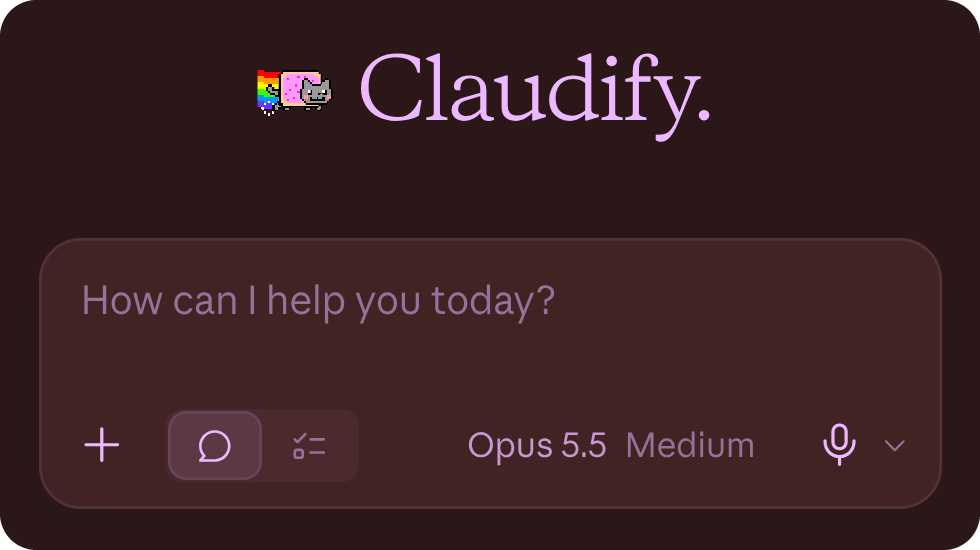
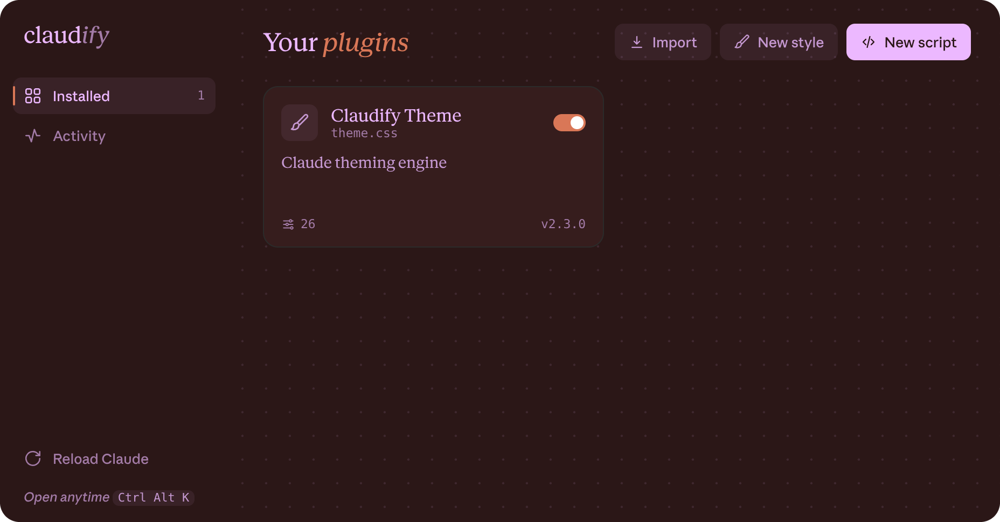

<p align="center"></p>

<h1 align="center">claudify</h1>

Themes and plugins for Claude Desktop on Linux. Recolor the app, change its fonts, swap Claude's
spark for Nyan Cat, or ask Claude to restyle itself.

<p align="center"></p>

## Install

You need Claude Desktop and `python3`. claudify works with Anthropic's `.deb`, the
[claude-desktop-debian](https://github.com/aaddrick/claude-desktop-debian) `.deb`, `.rpm` and
AppImage builds, on any distro.

```sh
curl -fsSL https://raw.githubusercontent.com/ImNoammm/claudify/main/install.sh | bash
```

Or from a clone:

```sh
git clone https://github.com/ImNoammm/claudify
cd claudify
./install.sh
```

The installer finds Claude Desktop on its own. If it can't find your AppImage, pass the path:
`./install.sh ~/Downloads/Claude.AppImage`. Restart Claude Desktop when it finishes.

A Claude installed from a system package lives in a root-owned folder, so the installer asks for
your password once. Package updates replace the patched file, so run `claudify install` again after
Claude updates. Flatpak and Nix installs are read-only and can't be patched; use the AppImage there.

## Use

Press Ctrl+Alt+K, or click the puzzle button in Claude's top bar, to open the plugins window.
The Claudify Theme comes with it. Its settings cover colors, fonts, text size, corner radius,
the spark animation and the new-chat greeting.
Every plugin page has an Export button that saves the plugin with your current settings built
in, so you can share it or bring it back later with Import.

<p align="center"></p>

You can also just ask Claude. The installer adds a Claudify connector, so in any chat you can say:

- "Use the Claudify connector to make the background dark blue"
- "Use the Claudify connector and set the chat font to mono"

The theme only covers colors, fonts, the spark and the greeting. For anything else, describe the
change and Claude writes a plugin for it:

- "Use the Claudify connector to remove the sidebar icons"
- "Use the Claudify connector to hide the Cowork button next to Chat"
- "Use the Claudify connector to make the chat column wider"
- "Use the Claudify connector to hide the mic button in the message box"
- "Use the Claudify connector to put a starry background behind the chat"
- "Use the Claudify connector to add a soft rainbow glow around the message box"

Changes apply right away without a restart. If Claude doesn't see the connector, check that
Claudify is switched on in the chat's connectors menu.

From a terminal:

```
claudify plugins        open the plugins window
claudify ls             list plugins
claudify add file.css   add a plugin (.css or .js)
claudify off <name>     turn a plugin off (on <name> turns it back on)
claudify edit <name>    edit a plugin in $EDITOR
claudify status         show what is installed
```

## Uninstall

```sh
claudify uninstall
```

This puts Claude Desktop back the way it was. Your plugins and settings stay in
`~/.config/claudify` in case you come back.

## Writing plugins

A plugin is a single `.css` or `.js` file with a header comment that can declare settings, and the
plugins window builds the controls for them. See [docs/plugins.md](docs/plugins.md).

If a plugin breaks Claude, start it with `CLAUDIFY_DISABLE=1 claude-desktop` and turn the plugin off.

## License

MIT
